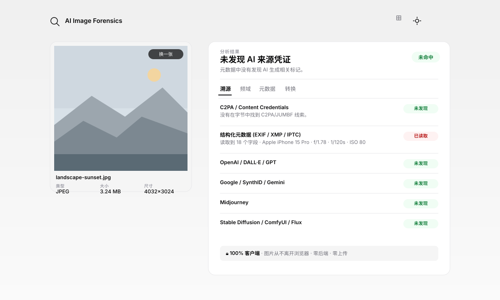

# AI Image Forensics

[](LICENSE)
[](#测试)
[](#)

**中文** · [English](README.en.md)

浏览器端 AI 图片鉴伪与溯源工具。支持批量导入、来源标记检测、元数据解析、频域分析和图片转换；图片全程留在本地设备，不上传服务器。

## 功能

- 批量选择或拖入 PNG、JPEG、WebP 图片，并在队列中切换查看。
- 检测 C2PA / Content Credentials 及常见 AI 生成工具留下的元数据标记。
- 展示 EXIF、XMP、IPTC、ICC、JUMBF 等图片信息。
- 使用 FFT、DCT、DWT 等 65 项频域特征提供启发式分析。
- 按统一配置批量转换图片，逐张下载处理结果。
- 完全在浏览器中运行，无后端、无图片上传。

## 界面预览




## 本地运行

```bash
git clone https://github.com/ZKunZhang/ai-image-forensics.git
cd ai-image-forensics
python3 -m http.server 8000
```

浏览器打开 <http://localhost:8000>。ES Modules 和 Web Worker 需要 HTTP 环境，不能直接使用 `file://`。

## 测试

项目使用 Node.js 内置测试运行器，无需安装第三方测试框架：

```bash
npm test
```

测试覆盖字节与文件大小工具、SHA-256 回退实现，以及 FFT、DCT、DWT 等核心纯函数。

## 技术说明

项目采用原生 HTML、CSS 和 ES Modules，无构建步骤。运行时使用 `exifr` 解析元数据、`piexifjs` 写入 EXIF，其余检测、频域变换和界面逻辑位于 `src/`。

频域结论属于启发式参考，不是确定性的 AI 图片分类结果。水印扰动和元数据转换能力仅用于隐私保护、兼容性验证与学术研究，不应用于欺诈、冒充或传播虚假信息。

## 项目协作

仓库级开发约定位于 [`.agents/AGENTS.md`](.agents/AGENTS.md)。

## 许可

[MIT](LICENSE) © 2026 zhaokun
